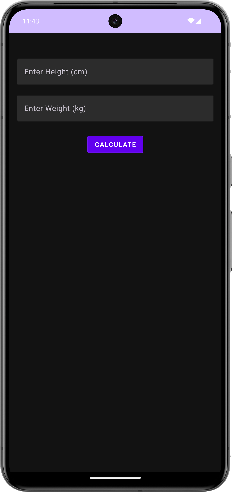
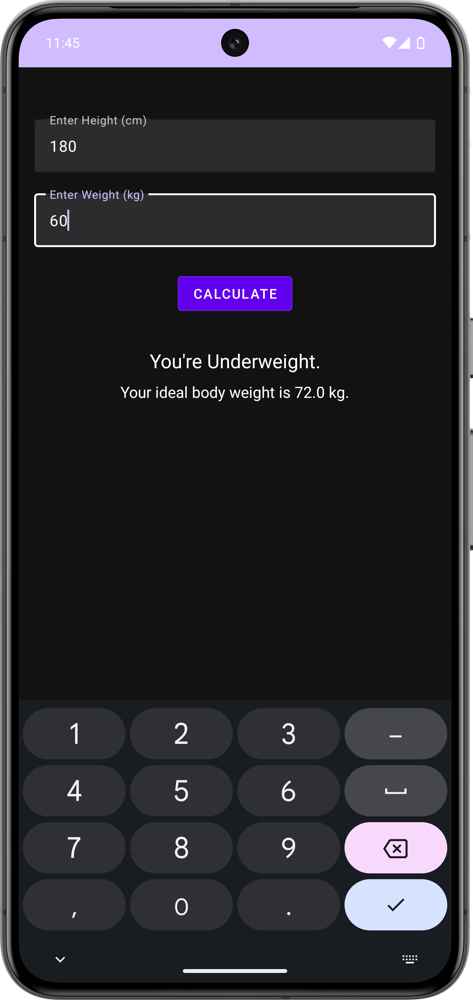

# Ideal Body Weight Calculator App

This is an Android app built using **Android Studio** to calculate a user's ideal body weight based on their height. It provides an easy-to-use interface where users can enter their height and get the ideal body weight along with suggestions about whether they are underweight, overweight, or at the ideal weight.

## Features

- Input your height to get the ideal body weight.
- Provides an indication of whether you are underweight, overweight, or at the ideal weight.
- Clean, simple UI for quick use.

## Screenshots

<table>
  <tr>
    <td></td>
    <td></td>
  </tr>
  <tr>
    <td>*Figure 1: Main Screen where you input height.*</td>
    <td>*Figure 2: Result Screen showing the ideal weight and BMI range.*</td>
  </tr>
</table>

## Getting Started

### Prerequisites

- Android Studio installed on your machine.
- An Android device or emulator to run the app.

### Installation

1. **Clone the repository**:

   ```bash
   git clone https://github.com/yourusername/IdealBodyWeightCalculator.git
   ```

2. **Open the project in Android Studio**:
   - Start Android Studio and select **Open an Existing Project**.
   - Navigate to the location where you cloned the repository and open the project.

3. **Build the project**:
   - Let Android Studio sync the Gradle files and resolve dependencies.
   - Click **Build** -> **Rebuild Project** to make sure everything is set up correctly.

4. **Run the app**:
   - Connect an Android device or launch an emulator.
   - Click the **Run** button in Android Studio to install and run the app on your device/emulator.

### Usage

1. Open the app on your device.
2. Input your height in the designated field.
3. Click the **Calculate** button.
4. The app will display your ideal body weight and indicate whether you're underweight, at an ideal weight, or overweight.
